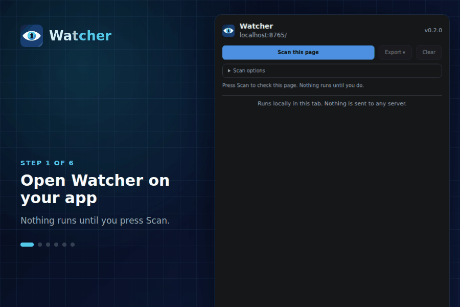
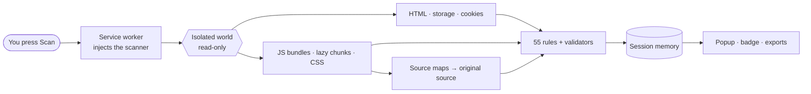

<div align="center">

<a id="top"></a>

<picture>
  <source media="(prefers-color-scheme: dark)" srcset="docs/assets/banner-dark.svg" />
  <source media="(prefers-color-scheme: light)" srcset="docs/assets/banner-light.svg" />
  
</picture>

<br />

[](https://github.com/atharvasail/watcher/actions/workflows/ci.yml)
[](https://github.com/atharvasail/watcher/actions/workflows/codeql.yml)
[](https://github.com/atharvasail/watcher/releases)
[](extension/manifest.json)
[](PRIVACY.md)
[](LICENSE)

### Find the API keys, tokens and passwords your web app shipped to the browser, before someone else does.

[**Install**](#-install) · [**Features**](#-features) · [**How it works**](#-how-it-works) · [**Security**](#-security--privacy) · [**Contribute**](CONTRIBUTING.md)

<br />



</div>

<br />

> [!IMPORTANT]
> Watcher is a defensive tool. Only scan applications you own or are authorised to test.


## ✨ Features

<table>
  <tr>
    <td width="33%" valign="top">
      <h3>🔑 55 detection rules</h3>
      <p>AWS, GitHub, Stripe, OpenAI, Anthropic, Slack, Supabase, Sentry, Vault and more, plus
      heuristic secrets, database URLs, internal hosts and debug leftovers.
      <a href="docs/rules.md">See all rules →</a></p>
    </td>
    <td width="33%" valign="top">
      <h3>⚖️ Evidence, not alarm</h3>
      <p>Public-by-design keys (Stripe <code>pk_</code>, Supabase <code>anon</code>, Mapbox
      <code>pk.</code>, Google browser keys) aren't called leaks. JWTs are decoded, so a
      <code>service_role</code> key is Critical and an <code>anon</code> key is Info.</p>
    </td>
    <td width="33%" valign="top">
      <h3>🗺️ Source-map check</h3>
      <p>Fetches referenced <code>.map</code> files. A reachable map is a confirmed exposure,
      and the original source inside it is scanned too, with library code skipped.</p>
    </td>
  </tr>
  <tr>
    <td valign="top">
      <h3>🧩 Sees lazy chunks</h3>
      <p>Finds code-split bundles through the browser's resource timeline, not only the
      <code>&lt;script&gt;</code> tags still in the DOM.</p>
    </td>
    <td valign="top">
      <h3>🍪 Storage and cookies</h3>
      <p>Reviews <code>localStorage</code>, <code>sessionStorage</code> and cookies visible to
      <code>document.cookie</code>, which proves they are missing HttpOnly.</p>
    </td>
    <td valign="top">
      <h3>📤 Reports your way</h3>
      <p>JSON, SARIF 2.1.0 for GitHub code scanning, or Markdown. Values are masked unless you
      choose otherwise.</p>
    </td>
  </tr>
  <tr>
    <td valign="top">
      <h3>🙈 Masked by default</h3>
      <p>Values and even the surrounding code stay masked until you press Reveal, so screen
      sharing is safe.</p>
    </td>
    <td valign="top">
      <h3>✅ Triage built in</h3>
      <p>Severity chips, text search, Accept/Reopen per finding, and a badge with the open count
      on each tab.</p>
    </td>
    <td valign="top">
      <h3>⏹️ Never in your way</h3>
      <p>Runs only on click, keeps going if the popup closes, and can be stopped with partial
      results kept.</p>
    </td>
  </tr>
</table>


## 🚀 Install

1. Download **`watcher-vX.Y.Z.zip`** from the [latest release](https://github.com/atharvasail/watcher/releases/latest) and unzip it.
2. Open `chrome://extensions` and switch on **Developer mode**.
3. Click **Load unpacked** and select the unzipped folder.
4. Pin Watcher to the toolbar. Shortcut: <kbd>Alt</kbd> + <kbd>Shift</kbd> + <kbd>S</kbd>.

<details>
<summary><b>Verify the download</b></summary>

Every release ships a `.sha256` file and a signed build-provenance attestation:

```bash
sha256sum -c watcher-vX.Y.Z.zip.sha256
gh attestation verify watcher-vX.Y.Z.zip --repo atharvasail/watcher
```

</details>

<details>
<summary><b>Install from source</b></summary>

```bash
git clone https://github.com/atharvasail/watcher.git
```

Then **Load unpacked** the `extension/` folder. Works in Chrome and other Chromium browsers,
version 116 or later. To scan `file://` pages, also enable **Allow access to file URLs** on the
extension's details page.

</details>

## 🕹️ Usage

|     | Step                                                                              |
| :-: | --------------------------------------------------------------------------------- |
| 1️⃣  | Open your app and click the Watcher icon.                                         |
| 2️⃣  | Press **Scan this page**. You can close the popup; the scan keeps going.          |
| 3️⃣  | Review findings. **Reveal** a value, **Copy** it, or **Accept** it once reviewed. |
| 4️⃣  | Filter by severity or text, then **Export** JSON, SARIF or Markdown.              |

<details>
<summary><b>Scan options</b></summary>

| Option                         | Default | Notes                                                     |
| ------------------------------ | :-----: | --------------------------------------------------------- |
| Inline scripts                 |   ✅    | includes JSON config blobs (`__NEXT_DATA__`-style)        |
| Linked JS files & chunks       |   ✅    | same origin; chunks found via the resource timeline       |
| Check source maps              |   ✅    | fetches referenced `.map` files and scans original source |
| CSS (inline & linked)          |   ✅    | internal URLs, tokens in `url()`, comments                |
| HTML attributes & comments     |   ✅    | `meta`, hidden inputs, `data-*`, comments                 |
| localStorage / sessionStorage  |   ✅    |                                                           |
| JS-readable cookies            |   ✅    | CSRF double-submit cookies are ignored                    |
| Include third-party files      |   ⬜    | only works where the CDN sends CORS headers               |
| Put unmasked values in exports |   ⬜    | treat such exports as secrets                             |

</details>

> [!TIP]
> Try it without touching a real app: `npm run serve`, then open <http://localhost:8765>. The
> fixture site has around 50 fake findings planted across every source type.

## 🎯 What it catches

| Severity                                                                    | Examples                                                                                                      |
| --------------------------------------------------------------------------- | ------------------------------------------------------------------------------------------------------------- |
|  | private keys, live secret keys, cloud / SCM / package tokens, DB URLs with passwords, Supabase `service_role` |
|          | AWS key IDs, webhooks, hard-coded `Authorization` headers, `user:pass@host` URLs                              |
|      | heuristic secrets and passwords, hard-coded JWTs, pre-filled password inputs                                  |
|            | staging / internal hosts, exposed source maps, session tokens in storage or readable cookies                  |
|          | public-by-design keys, placeholders, source-map references, `debugger;`, console logging                      |

Heuristic findings are tagged **needs review**. Treat every Critical or High as compromised:
rotate it, then remove it from the build and from the repository history.


## 🧠 How it works



The scanner runs in Chrome's isolated world, so page scripts can't see or tamper with it. It
re-reads the page's own files (from the browser cache where possible), runs every rule, checks
source maps, and reports back to the service worker, which keeps results in memory only. Full
details and the threat model are in [docs/architecture.md](docs/architecture.md).

## 🔒 Security & privacy

| Guarantee                  | How it is enforced                                                                                     |
| -------------------------- | ------------------------------------------------------------------------------------------------------ |
| 🏠 **Local only**          | Extension pages run with `connect-src 'none'`: they cannot make network requests at all.               |
| 👀 **Read-only**           | No DOM, storage or cookie writes on the page. Tests assert zero DOM mutations after a scan.            |
| 🧱 **XSS-safe UI**         | DOM built with `textContent` only; lint bans HTML sinks; Trusted Types make any `innerHTML` throw.     |
| 🔐 **Minimal permissions** | `activeTab`, `scripting`, `storage`. No host permissions, content scripts or remote code, gated in CI. |
| 💾 **No secrets on disk**  | Results live in session memory and vanish with the tab; accepted findings are salted SHA-256 hashes.   |
| 📦 **Supply chain**        | Zero runtime dependencies, reproducible builds, SHA-256 checksums and signed build provenance.         |

Read more: [PRIVACY.md](PRIVACY.md) · [SECURITY.md](SECURITY.md) (report a vulnerability) ·
[docs/store-listing.md](docs/store-listing.md) (Chrome Web Store notes)


## 🛠️ Development

```bash
npm ci
npx playwright install chromium
npm run verify   # lint · format · manifest + contrast gates · rules docs · unit + e2e tests · build
```

<details>
<summary><b>All scripts</b></summary>

| Command                  | What it does                                                            |
| ------------------------ | ----------------------------------------------------------------------- |
| `npm run serve`          | Fixture site with planted fake secrets at <http://localhost:8765>       |
| `npm run lint`           | ESLint, including `no-unsanitized` (blocks `innerHTML`-style sinks)     |
| `npm test`               | Rule, export and tooling tests (`node:test`)                            |
| `npm run test:e2e`       | Loads the extension in real Chromium and scans the fixture (Playwright) |
| `npm run check:manifest` | Fails on new permissions, weaker CSP or missing files                   |
| `npm run check:contrast` | WCAG AA contrast for the popup in light and dark themes                 |
| `npm run docs:rules`     | Regenerates [docs/rules.md](docs/rules.md) from the rule definitions    |
| `npm run fp-baseline`    | Measures false positives against real library code                      |
| `npm run build`          | Reproducible `dist/watcher-v<version>.zip` + `.sha256`                  |

</details>

<details>
<summary><b>Project structure</b></summary>

```
extension/
├── manifest.json
├── background/service-worker.js   injects/stops scans, stores results, badge
├── shared/common.js               config, grouping, hashing (all contexts)
├── shared/triage.js               accepted findings as salted fingerprints
├── scanner/                       injected into the page's isolated world on demand
│   ├── lib/helpers.js             entropy, placeholders, JWT decoding, host classification
│   ├── rules/                     vendor · generic · infrastructure · debug
│   ├── engine.js                  text → findings (masking, dedupe, locations)
│   ├── sources.js                 read-only collectors, own-origin fetch, source maps
│   └── scan.js                    orchestration, cancel, post-passes
└── popup/                         dom.js (safe DOM) · render.js · export.js · popup.js
scripts/    build, manifest policy, contrast gate, rules docs, false-positive baseline
tests/      node:test unit tests + Playwright end-to-end suite
test-site/  fixture app with planted fake secrets (strict CSP)
```

</details>

Releasing: bump the version in `package.json` and `extension/manifest.json`, update
[CHANGELOG.md](CHANGELOG.md), then push a `vX.Y.Z` tag. The release workflow tests, builds,
attests and publishes the zip. Contribution guidelines and the rule format are in
[CONTRIBUTING.md](CONTRIBUTING.md).

## 🗺️ Roadmap

- [x] Source-map exposure check with original-source scanning
- [x] SARIF export for GitHub code scanning
- [x] Accept/Reopen triage stored as salted hashes
- [ ] Same-origin iframes
- [ ] DevTools panel
- [ ] Per-rule enable/disable and custom rules
- [ ] Diff between two scans
- [ ] Firefox (MV3) build

## ⚠️ Limitations

- Scans the top frame only. `HttpOnly` cookies, service-worker caches and network traffic are out of scope.
- Pattern matching finds candidates; it cannot prove that a key is live.
- It complements repository scanners (gitleaks, trufflehog, GitHub secret scanning) rather than
  replacing them. Its strength is what they miss: build-time env inlining (`VITE_*`,
  `NEXT_PUBLIC_*`, `REACT_APP_*`), published source maps and runtime storage.

<br />

<div align="center">


**Watcher** · [MIT License](LICENSE) · Made by [Atharva Sail](https://github.com/atharvasail)

<sub><a href="#top">Back to top ↑</a></sub>

</div>
